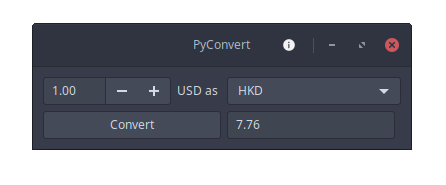

# PyConvert

**Needs help with...**
  - store/cache api data, so we can cut down on number of requests
  - new design (see [example][dribbble])
 

[dribbble]: https://dribbble.com/shots/5855502-Currency-cryptocurrency-exchange-app
